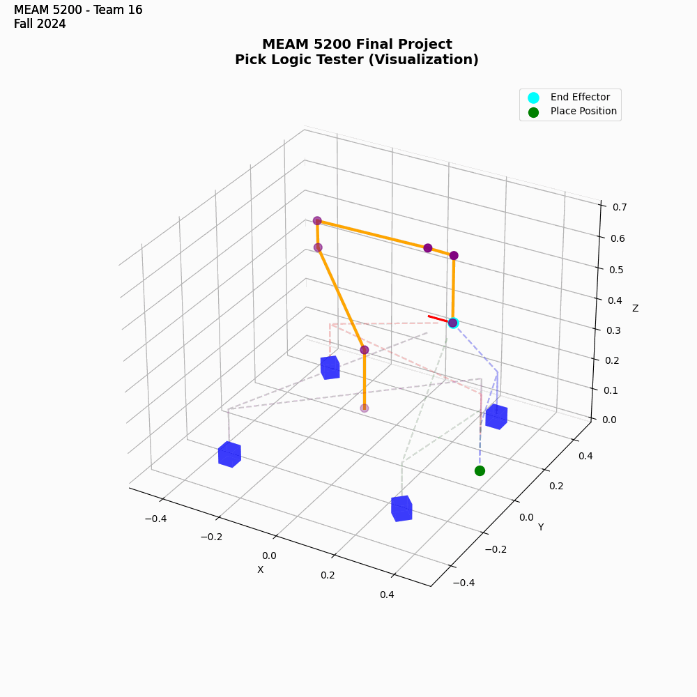

# MEAM 5200 Final Project
[](https://www.python.org/downloads/)
[](https://www.franka.de/)

## Project Overview
This project implements a robotic manipulation system capable of performing pick and place operations using the Panda robot arm. The implementation includes forward kinematics, inverse kinematics, and trajectory planning.
Part of MEAM 5200 Final Project of Fall 2024

## Project Structure
    .
    ├── lib/                      # Core kinematics libraries
    │   ├── calculateFK.py        # Forward Kinematics calculation
    │   ├── IK_position_null.py   # Position-based Inverse Kinematics
    │   └── franka_IK.py          # Franka-specific Inverse Kinematics (fallback)
    ├── core/                     # Core implementation files
    │   ├── interfaces.py         # Interface definitions
    │   ├── safety.py             # Safety checks and constraints
    │   └── utils.py              # Utility functions
    ├── labs/
    │   └── final/                # Final project scripts and configurations
    │       ├── final.py          # Main execution script
    │       └── config.json       # Team-specific configuration parameters
    ├── scripts/                  # Testing and demonstration scripts
    │   ├── mock.py               # Local simulation library for arm control
    │   ├── pick_tester.py        # Testing script using mock controller
    │   ├── static_demo.py        # Static block manipulation demo
    │   └── dynamic_demo.py       # Dynamic block retrieval demo
    └── README.md                 # Project documentation

## Prerequisites
- Python 3.8 or higher
- Library dependency
- Franka ROS and libfranka
- Linux System

## Installation
1. Clone the repository
2. Install Python dependencies
3. Install ROS dependencies
4. Set up the Franka ROS environment
5. Launch the ROS nodes
6. Run the main script:
   ```sh
   python labs/final/final.py
   ```

## Inverse Kinematics (`IK_position_null.py`)

The `IK_position_null.py` script implements numerical inverse kinematics with a secondary task using the Panda robot's kinematics. It calculates joint configurations to achieve a desired end-effector pose while optimizing for joint limits.

### Key Features

- **Primary Task**: Computes joint velocities to reduce the error between the current and target end-effector poses using either the Jacobian pseudo-inverse or transpose methods.
- **Secondary Task**: Implements joint centering to keep joint angles within their limits by minimizing the offset from the center of their range of motion.
- **Solver Parameters**: Allows adjustment of linear and angular tolerances, maximum steps, and minimum step sizes for convergence control.

### Usage

- Run the script directly to see example usage with predefined seed and target poses.
- Adjust the solver parameters as needed for different scenarios.

### Visualization


## Final Implementation (`final.py`)

The `final.py` script is the main execution file for the project, located in `labs/final/`. It integrates all functionalities, including dynamic block retrieval, static block manipulation, and coordinated pick and place operations.

### Logic Overview

- **Configuration Loading**: Loads team-specific configurations from `config.json` based on the team parameter (`red` or `blue`).
- **Initialization**: Sets up the ROS node, arm controller, and object detector.
- **Dynamic Block Retrieval**: Continuously retrieves dynamic blocks using predefined poses and places them at designated stacking positions.
- **Static Block Manipulation**: Detects static blocks using the object detector, filters and refines detections, and performs pick and place operations to a specified target location.
- **Inverse Kinematics Handling**: Uses the custom IK solver from `IK_position_null.py` and falls back to `franka_IK.py` if needed.
- **Error Handling and Recovery**: Implements checks for grasp success and retries grasps or movements in case of failures.

### How to Use

1. **Setup Environment**:
   - Ensure all dependencies are installed.
   - Verify that the robot arm is properly connected and configured.
   - Launch necessary ROS nodes.

2. **Load Configuration**:
   - Update `config.json` in `labs/final/` with your team's parameters if necessary.

3. **Run the Script**:
   - Navigate to the `labs/final/` directory.
   - Execute the main script using ROS

### Demonstration (Static)



## Implementation Details

### Block Detection and Manipulation
- **Static Block Detection**: Uses computer vision through the ObjectDetector class with temporal filtering to ensure reliable block detection
- **Dynamic Block Retrieval**: Implements a state machine approach with predefined poses for reliable block acquisition
- **Stacking Strategy**: 
  - Dynamic blocks are stacked in two locations (4 blocks each)
  - Static blocks are stacked with 5cm vertical spacing
  - Implements automatic stack height management

### Error Recovery
- **Grasp Verification**: Checks gripper state to confirm successful grasps
- **IK Fallback System**: Uses custom IK solver with fallback to Franka's built-in IK
- **Movement Recovery**: Implements recovery poses and movements for failed grasps
- **Retry Logic**: Automatic retry for dynamic block acquisition

### Performance Optimization
- **Speed Control**: Dynamic speed adjustment based on operation phase
- **Path Planning**: Uses intermediate poses to avoid collisions
- **Detection Filtering**: Implements temporal filtering with confidence thresholds

## Troubleshooting

### Common Issues
1. **IK Solver Failures**
   - Check if target pose is reachable
   - Verify joint limits in IK_position_null.py
   - Try adjusting the seed pose and alpha value

2. **Grasp Failures**
   - Verify gripper calibration
   - Check force and position parameters
   - Ensure proper block detection

3. **Vision System Issues**
   - Verify camera calibration
   - Check lighting conditions
   - Ensure proper transformations

### Debug Tools
- Use `mock.py` for testing without physical robot
- Enable debug printing in final.py
- Monitor ROS topics for real-time debugging

## License
This project is licensed under the MIT License - see the LICENSE file for details.

## Acknowledgments

Project developed for MEAM 5200 "Intro to Robotics" at the University of Pennsylvania. 

- Simulation done in ROS and Gazebo
- Library credits to Emika Franka and Dr. Nadia Figueroa
