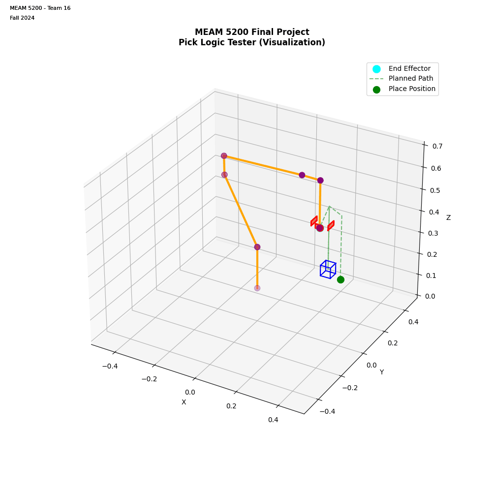

# 5200-Project
MEAM 5200 Final Project

## Project Structure
    lib/
    ├── calculateFK.py
    ├── calcJacobian.py
    ├── IK_position_null.py
    ├── IK_velocity_null.py
    ├── FK_velocity.py
    └── Other scripts...

## Pick and Place Testing

The `pick_tester.py` script demonstrates the robot's ability to perform pick and place operations.

### Demonstration

